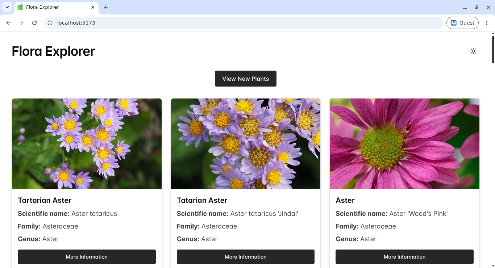

# Flora Explorer 🌿

[](https://react.dev)
[](https://www.typescriptlang.org)
[](https://vitejs.dev)
[](LICENSE)

A responsive web application for discovering random plants from around the world. Built with React, TypeScript, and Chakra UI, Flora Explorer integrates with the Perenual API to fetch and display plants data.

## 🌐 Live Demo

[https://flora-explorer.vercel.app](https://flora-explorer.vercel.app)

## 📸 Preview



## ✨ Features

- **Display random plants** – Fetch and display thirty random plants with each request
- **Responsive layout** – Works seamlessly on desktop, tablet, and mobile devices
- **Dark/Light mode** – Toggle between themes for comfortable viewing
- **Skeleton loading states** – Smooth loading experience while fetching data
- **Error handling** – Graceful error messages for API failures
- **Real plant data** – Integrated with the Perenual API for accurate information

## 🎯 Project Highlights

- **Type-safe code** – Full TypeScript implementation for robustness
- **Reusable components** – Clean, modular React component architecture
- **Environment variables** – Secure API key management
- **Responsive design** – Mobile-first approach with Chakra UI
- **Clean folder structure** – Well-organized codebase for maintainability

## 🛠️ Tech Stack

- **React 19**
- **TypeScript**
- **Vite**
- **Chakra UI**
- **Perenual API**

## 📋 Requirements

- **Node.js** 18+
- **npm** or **Bun**

## 🚀 Installation

### 1. Clone this repository:

```bash
git clone https://github.com/DanielYanesDev/flora-explorer.git
cd flora-explorer
```

### 2. Install dependencies:

```bash
npm install
```

Or with Bun:

```bash
bun install
```

## 🔑 Environment Variables

Create a `.env` file in the root directory:

```env
VITE_API_KEY=your_perenual_api_key_here
VITE_API_URL=https://perenual.com/api/v2/species-list
```

## 📜 Scripts

| Command | Description |
|---------|-------------|
| `npm run dev` | Start the development server |
| `npm run build` | Build the application for production |
| `npm run preview` | Preview the production build |
| `npm run lint` | Run ESLint to check code quality |
| `npm run lint:fix` | Run ESLint and automatically fix issues |

The app will be available at `http://localhost:5173`.

## 📁 Project Structure

```
src/
├── components/
│   ├── Footer.tsx
│   ├── Icons.tsx
│   ├── Layout.tsx
│   ├── PlantCard.tsx
│   ├── PlantsView.tsx
│   └── ui/
│       ├── color-mode.tsx
│       ├── provider.tsx
│       ├── toaster.tsx
│       └── tooltip.tsx
├── utils/
│   └── functions.ts
├── constants.ts
├── types.d.ts
├── App.tsx
├── main.tsx
└── index.css
```

## 📚 About

This project was built to practice and showcase:

- React hooks and state management
- TypeScript for type-safe development
- API integration and data fetching
- Responsive UI design with Chakra UI
- Component-based architecture
- Modern build tools and development workflows

## 📖 API Reference

Flora Explorer uses the [Perenual API](https://perenual.com/) to fetch plant data. The endpoint used is: `https://perenual.com/api/v2/species-list`

> An API key is required. Get yours for free at [https://perenual.com/user/developer](https://perenual.com/user/developer)

## 🤝 Contributing

Contributions are welcome. Please read [CONTRIBUTING.md](CONTRIBUTING.md) for guidelines before opening a pull request.

## 📄 License

This project is licensed under the MIT License. See the [LICENSE](LICENSE) file for details.

> If you found this project interesting, feel free to leave a ⭐ on the repository!
